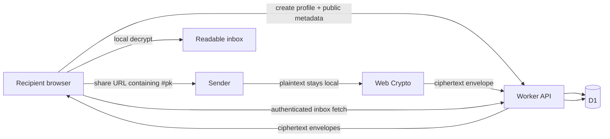

# 01 - Nibhrito Master Plan

## 1. Product definition

Nibhrito is a privacy-first anonymous feedback and confession platform. A recipient creates a profile and shares a unique link. A sender opens that link, writes a message, and the browser encrypts the content before upload. The backend stores only an encrypted envelope and delivery metadata needed to operate the service.

### Primary users

- students collecting honest peer feedback,
- creators receiving anonymous comments,
- professionals collecting candid suggestions,
- small communities collecting private opinions.

### Primary value

- sender identity is not shown to the recipient,
- message content is encrypted in the sender's browser,
- the backend does not possess the recipient's decryption key,
- the recipient decrypts locally,
- messages expire automatically,
- the system minimizes retained metadata.

## 2. Claims we can and cannot make

### Defensible claims

- “Messages are encrypted in the browser before upload.”
- “Stored message bodies are ciphertext.”
- “Nibhrito's application server does not hold the recipient's message-decryption key.”
- “The recipient decrypts messages locally.”
- “The application database does not intentionally store raw sender IP addresses.”

### Claims to avoid

- “100% untrackable.”
- “No one can identify a sender.”
- “Impossible to hack.”
- “The developer can never access future plaintext under any circumstance.”
- “Free hosting forever.”

Network providers necessarily process connection metadata, recipient devices can be compromised, and a web operator controlling future JavaScript can theoretically attempt a malicious build. The architecture significantly reduces trust in the server but does not eliminate all endpoint and delivery-channel risk.

## 3. Architecture decision

### Frontend

- React
- TypeScript strict mode
- Vite
- Tailwind CSS
- Native Web Crypto API
- IndexedDB for local cryptographic state
- No SSR for MVP
- No remote runtime JavaScript on sensitive routes

Why: a static SPA minimizes server complexity, makes the crypto boundary clear, and can be hosted as static assets at no request cost on the selected platform.

### Backend

- Cloudflare Worker
- TypeScript
- Hono recommended for routing, kept thin
- Zod or equivalent schema validation shared between client and API
- No backend framework that requires a long-running server

### Database

- Cloudflare D1
- SQLite-compatible migrations
- Repository abstraction around D1 queries
- Cursor pagination, indexed expiry queries, no full-table scans in hot paths

### Deployment

- Cloudflare Worker + Static Assets
- D1 binding for database
- Workers Cron Trigger for expiry cleanup
- GitHub for source control
- `*.workers.dev` hostname for zero-cost initial deployment
- custom domain only when the owner is willing to pay yearly domain registration

## 4. Why Cloudflare is the recommended v1 platform

It keeps static hosting, API, SQL storage, cron cleanup, TLS, and edge delivery in one deployment model. This reduces operational failure modes and avoids combining several free-tier vendors.

Free-tier limits must be treated as capacity constraints, not promises of permanent free service. As verified on 2026-10-03, Workers Free allows 100,000 Worker requests/day, D1 includes 5 million rows read/day and 100,000 rows written/day, and static asset requests are free/unlimited. D1 free storage is constrained, so quotas and expiry are part of the product design rather than an afterthought.

## 5. Core data flow



The `#pk` URL fragment is not part of the HTTP request sent to the server. The sender client uses that fragment as the recipient public encryption key.

## 6. MVP scope

### Include

- create anonymous recipient profile,
- choose display name, prompt, theme, and message retention period,
- create/share a cryptographic profile link,
- QR code generation locally,
- send text-only encrypted message,
- optional mood/category stored inside ciphertext,
- encrypted inbox,
- local decryption,
- delete message,
- expiry policy,
- encrypted recovery bundle,
- restore profile on a new device using recovery code,
- disable/delete profile,
- privacy, terms, acceptable-use, security pages,
- abuse controls and sender throttling,
- accessibility and mobile-first UI.

### Explicitly exclude from MVP

- file/image/audio attachments,
- public comments,
- group chats,
- real-time chat/websocket,
- phone/email identity,
- password reset,
- AI reading/moderating private messages,
- server-side search of messages,
- end-to-end encrypted replies,
- full Signal-style forward secrecy,
- ad networks and behavioral analytics.

## 7. Product experience

### Recipient onboarding

1. Open Nibhrito.
2. Choose display name/slug and a short public prompt.
3. Browser generates encryption key material and owner recovery material.
4. Profile is created with public metadata.
5. User is forced to save a recovery code before completing setup.
6. Nibhrito produces the full share link containing the recipient public key fragment.
7. User can copy link or generate a QR code.

### Sender flow

1. Open recipient's complete share link.
2. Client validates the `#pk` fragment and supported protocol version.
3. Client fetches only public profile metadata.
4. Sender writes message.
5. Client generates a fresh ephemeral ECDH key pair.
6. Client derives a one-message symmetric key and encrypts locally.
7. Only the encrypted envelope is uploaded.
8. Sender sees an acknowledgement after durable storage.

### Recipient inbox flow

1. Owner authentication is loaded locally.
2. API returns encrypted envelopes.
3. Browser derives each message key and decrypts locally.
4. UI holds plaintext in memory only as needed.
5. Delete requests remove the server record; local UI clears plaintext immediately.

## 8. Privacy-preserving recovery

A zero-account app still needs a safe recovery story.

During profile creation:

- generate a high-entropy `recovery_secret` in the browser,
- export the encryption private key only during initial setup,
- create a recovery JSON payload containing private key material, owner token, protocol version, and key id,
- encrypt that payload with a key derived from `recovery_secret`,
- upload only the encrypted recovery blob,
- display the recovery code once and ask the user to save it,
- re-import the working private key as non-extractable and store the `CryptoKey` in IndexedDB,
- erase temporary export variables as far as JavaScript allows.

Restore flow:

- user enters profile slug and recovery code,
- backend returns encrypted recovery blob,
- browser decrypts locally,
- validates key id against the profile/share identity,
- imports private key as non-extractable,
- restores owner token locally.

The server never receives the recovery secret.

## 9. Abuse and moderation model

E2EE prevents server-side content moderation by design. Therefore safety controls must operate around content rather than secretly weakening encryption.

Use:

- maximum message byte size,
- request schema validation,
- per-profile submission quotas,
- per-network short-window rate limits using a rotating HMAC-derived bucket, not raw stored IP,
- global emergency rate limit,
- profile disable switch,
- recipient delete/block controls,
- optional challenge escalation under detected abuse,
- recipient-controlled voluntary report flow in a later phase.

If a recipient reports a message for moderation, the UI must explicitly explain that reporting will disclose that selected message to moderators. Reporting must be opt-in per message.

Never add a hidden server decryption key or “law-enforcement master key.”

## 10. Message expiry

Default retention: 30 days.

Recommended choices: 1 day, 7 days, 30 days, 90 days.

Rules:

- backend computes canonical `expires_at`,
- retrieval always filters `expires_at > now`,
- index `expires_at`,
- scheduled cleanup deletes expired rows,
- opportunistic cleanup runs in bounded batches during safe API operations,
- do not promise immediate physical erasure from infrastructure backups.

Cloudflare D1 free accounts currently have a 7-day Time Travel recovery window. Deleted ciphertext can therefore remain recoverable at the infrastructure layer for that recovery window. This must be described accurately in the privacy documentation.

## 11. Scalability strategy

### Small usage

One Worker + one D1 database is enough.

### Moderate growth

- optimize indexes,
- enforce cursor pagination,
- batch deletes,
- cache public profile metadata where safe,
- shard old/large data only if free-tier database limits become a real constraint,
- upgrade Worker/D1 plan if operationally justified.

### Larger growth

The codebase should expose interfaces for:

- `ProfileRepository`,
- `MessageRepository`,
- `RecoveryRepository`,
- `RateLimitStore`.

This makes migration possible to managed Postgres or another SQL backend without rewriting browser crypto.

## 12. Security priorities

The highest-risk component is not D1. It is the JavaScript that handles plaintext and keys.

Priorities:

1. prevent XSS,
2. prevent remote-script supply-chain exposure,
3. keep crypto code small and heavily tested,
4. validate the full share link public key,
5. avoid logging secrets,
6. use strict security headers,
7. protect dependency updates,
8. make recovery explicit and testable,
9. keep server blind to plaintext,
10. document unavoidable limitations.

## 13. Fun features that fit the privacy model

Good additions:

- themes and profile accent choices,
- locally generated QR share card,
- anonymous “mood” or “type” tags encrypted inside the message,
- random constructive-feedback prompt suggestions,
- “one thing I appreciate / one thing to improve” template,
- local-only inbox search after decryption,
- local archive export encrypted with a user-provided export key,
- reveal animation for a newly decrypted message,
- streak or message-count UI only if calculated client-side from the inbox and not made public by default.

Avoid engagement mechanics that pressure users to send more anonymous content or expose message counts publicly.

## 14. Future cryptographic upgrades

Potential later work:

- X25519 after browser-support verification,
- recipient signed prekey pools for stronger forward secrecy,
- multi-device key authorization,
- passkey-based local unlock,
- native desktop/mobile client with stronger protection against malicious web-build replacement.

These are not MVP requirements.

## 15. Success criteria

Nibhrito v1 is successful when a security review can verify all of the following:

- backend never receives message plaintext,
- database breach reveals ciphertext but not message contents,
- recovery blob is useless without recovery secret,
- raw sender IP is absent from application DB/logging code,
- share-link key mismatch fails closed,
- XSS protections are strict,
- expired messages disappear from all application queries immediately after expiry,
- cleanup eventually deletes expired DB rows,
- lost recovery code correctly means unrecoverable content,
- all critical flows pass cross-browser E2E tests.


---

# 03 - E2EE Protocol Specification

This document is normative for Nibhrito v1. Do not change field meanings or cryptographic steps without a protocol version bump and migration plan.

## 1. Goals

Protect message confidentiality and integrity from:

- database readers,
- accidental backend logging,
- ordinary server-side application access,
- passive storage compromise.

Nibhrito v1 does not claim full forward secrecy against later compromise of the recipient's long-lived private key.

## 2. Algorithms

### Recipient key agreement

- Web Crypto `ECDH`
- curve `P-256`

Reason: broad browser support and native Web Crypto availability. X25519 is attractive but should be a future protocol version after explicit compatibility verification.

### KDF

- `HKDF`
- SHA-256
- random 32-byte salt per message

### Message AEAD

- AES-GCM
- 256-bit key
- random 12-byte IV per message
- 128-bit authentication tag

### Hash

- SHA-256

## 3. Canonical encoding

- binary fields use unpadded base64url,
- text uses UTF-8,
- protocol object field names are fixed,
- AAD is a deterministic UTF-8 string produced by the protocol helper, not ad hoc JSON stringification.

Example AAD format:

```text
nibhrito:v1|profile=<normalized-slug>|message=<uuid>|key=<key-id>
```

The exact formatter must have unit-test vectors.

## 4. Recipient profile key generation

Browser:

1. `crypto.subtle.generateKey({ name: "ECDH", namedCurve: "P-256" }, true, ["deriveBits"])`
2. export public key as `raw`,
3. export private key as JWK only during initial recovery-package creation,
4. compute `key_id = base64url(SHA-256(raw_public_key))`,
5. create recovery bundle,
6. re-import the private JWK with `extractable = false`,
7. store the non-extractable private `CryptoKey` in IndexedDB,
8. remove temporary exported private material from application state.

The raw public key becomes part of the share URL fragment.

## 5. Message encryption

Inputs:

- recipient raw P-256 public key from URL fragment,
- normalized profile slug,
- plaintext message object.

Plaintext object example:

```json
{
  "type": "message",
  "text": "...",
  "mood": "constructive",
  "client_created_at": "2026-10-03T00:00:00.000Z"
}
```

Steps:

1. Validate plaintext UTF-8 byte length before encryption.
2. Generate `message_id = crypto.randomUUID()`.
3. Import recipient public key as ECDH P-256.
4. Generate a fresh ephemeral ECDH P-256 key pair for this message.
5. Derive 256 ECDH bits using sender ephemeral private key + recipient public key.
6. Import derived bits as HKDF key material.
7. Generate `salt = random 32 bytes`.
8. Derive an AES-256-GCM key with HKDF-SHA-256 and info:

```text
nibhrito:v1:message
```

9. Generate `iv = random 12 bytes`.
10. Build deterministic AAD from version, normalized slug, message id, and key id.
11. UTF-8 encode the canonical plaintext JSON.
12. Encrypt using AES-GCM with 128-bit tag.
13. Export the sender ephemeral public key in raw form.
14. Upload only the envelope.

## 6. Message envelope

```json
{
  "v": 1,
  "message_id": "uuid",
  "profile_slug": "example",
  "key_id": "base64url-sha256",
  "ephemeral_pub": "base64url",
  "hkdf_salt": "base64url",
  "iv": "base64url",
  "ciphertext": "base64url"
}
```

Backend may add server metadata such as `created_at` and `expires_at` outside the cryptographic envelope.

Backend must not rewrite cryptographic envelope fields.

## 7. Message decryption

1. Validate envelope version and field byte lengths.
2. Confirm envelope `key_id` matches a key in the recipient keyring.
3. Import sender ephemeral public key.
4. Derive ECDH shared bits with recipient private key.
5. HKDF with stored salt and fixed protocol info.
6. Rebuild exact AAD.
7. AES-GCM decrypt.
8. Parse JSON only after authentication succeeds.
9. Validate decrypted object schema before rendering.
10. Render text as text content, never HTML.

Any AES-GCM authentication failure must be treated as tampering/corruption. Do not display partial plaintext.

## 8. Recovery protocol

### Recovery secret

Generate 32 random bytes in the browser. Encode as a human-copyable base64url string with a version prefix and checksum in the UI.

Example format conceptually:

```text
NBR1-<high-entropy-value>-<checksum>
```

Do not derive this from a user password in MVP.

### Recovery bundle plaintext

```json
{
  "v": 1,
  "profile_slug": "example",
  "key_id": "...",
  "recipient_private_jwk": {},
  "owner_token": "...",
  "created_at": "..."
}
```

### Recovery bundle encryption

1. Generate random 32-byte salt.
2. Import recovery secret as HKDF input key material.
3. HKDF-SHA-256 info: `nibhrito:v1:recovery`.
4. Derive AES-256-GCM key.
5. Generate 12-byte random IV.
6. AAD: `nibhrito:v1:recovery|profile=<slug>|key=<key-id>`.
7. Encrypt canonical JSON.
8. Upload only the encrypted recovery blob, salt, IV, key id, and version.

The recovery secret itself must not be uploaded.

## 9. Owner token

Generate a separate random 32-byte owner token. Do not derive it from the encryption key.

Server stores only a SHA-256 verifier of the token. Requests authenticate over HTTPS with the raw token in an authorization header. Redaction middleware must remove this header from logs.

A future version may replace bearer auth with asymmetric request signing, but that is not required for MVP.

## 10. Key rotation

MVP may postpone UI key rotation. The data model must nevertheless include `key_id` so a future keyring can decrypt historical messages after rotation.

Never overwrite the identity of an existing key id.

## 11. Required test vectors

Create deterministic fixtures for:

- base64url encode/decode,
- public-key import/export,
- SHA-256 key id,
- AAD formatting,
- recovery bundle round trip,
- message round trip,
- tampered ciphertext rejection,
- tampered AAD rejection,
- wrong private key rejection,
- malformed ephemeral key rejection,
- max-length UTF-8 message.

For random APIs, inject deterministic bytes in unit tests rather than weakening production randomness.


---

# 04 - Security and Threat Model

## Assets

Highest sensitivity:

- message plaintext,
- recipient private encryption key,
- recovery secret,
- owner token,
- decrypted inbox state.

Moderate sensitivity:

- encrypted recovery blob,
- ciphertext messages,
- profile metadata,
- rate-limit bucket identifiers.

## Adversaries considered

- database thief,
- accidental operator access,
- malicious sender,
- bot/spam sender,
- XSS attacker,
- dependency/supply-chain attacker,
- network observer outside TLS termination,
- stolen/lost recipient device,
- attacker with copied recovery code,
- attacker tampering with ciphertext.

## Security properties

### Database compromise

Expected outcome: attacker obtains ciphertext, public metadata, encrypted recovery blob, and hashed owner verifier. Message plaintext and recipient private key should remain unavailable without recovery secret/private key.

### Passive network observer

TLS protects transport; E2EE means message body is also encrypted before transport. Network-level metadata such as source/destination/timing is not hidden by Nibhrito.

### Malicious sender

Can submit abusive ciphertext but cannot directly execute HTML/JS if rendering is text-only. Abuse controls limit volume but cannot infer message meaning server-side.

### XSS

Critical risk. If arbitrary JavaScript executes in recipient/sender pages, it can read plaintext or invoke cryptographic keys while the page is active.

Required mitigations:

- strict CSP response headers,
- no inline scripts where avoidable,
- no `dangerouslySetInnerHTML` for message/user content,
- no remote JavaScript on crypto routes,
- bundled and locked dependencies,
- text-only message rendering,
- output encoding,
- dependency audit,
- minimal DOM injection surfaces.

### Malicious future frontend build

A web operator with control of deployment can theoretically ship JavaScript that captures future plaintext or key material. A normal web app cannot cryptographically eliminate this trust without an independently verified client distribution mechanism.

Mitigations:

- open source client,
- reproducible builds where practical,
- transparent release hashes,
- immutable release tags,
- no runtime remote scripts,
- future native/browser-extension client for users requiring stronger client-distribution trust.

Do not claim protection against a malicious deployed frontend.

### Public-key substitution

Mitigation: recipient public key is carried in the share URL fragment. A database-only attacker cannot silently replace the public key the sender uses. The client must fail closed if fragment parsing or key import fails.

This does not protect against malicious JavaScript that ignores the protocol.

### Device compromise

Out of scope. Malware or a compromised browser profile can read rendered plaintext and potentially use local keys.

### Recovery code theft

Anyone with the recovery code plus access to the encrypted recovery blob can restore the private key. Therefore recovery code must be treated like a password-manager secret.

## Metadata minimization

Application database should not retain:

- raw IP,
- user agent history,
- browser fingerprint,
- referrer history,
- third-party analytics identifiers.

For abuse throttling, derive a rotating bucket identifier:

```text
bucket = HMAC-SHA-256(server_rate_secret_for_day, normalized_source_ip)
```

Store only the bucket, time window, and count. Rotate the HMAC secret and expire bucket rows quickly.

Important: the hosting/network provider still processes source IP to deliver traffic. Privacy copy must distinguish “not stored by the application” from “never processed anywhere.”

## Recommended security headers

At minimum:

```text
Content-Security-Policy: default-src 'self'; script-src 'self'; style-src 'self'; img-src 'self' data:; connect-src 'self'; font-src 'self'; object-src 'none'; base-uri 'none'; frame-ancestors 'none'; form-action 'self'
Referrer-Policy: no-referrer
X-Content-Type-Options: nosniff
Permissions-Policy: camera=(), microphone=(), geolocation=(), payment=(), usb=()
Cross-Origin-Opener-Policy: same-origin
Strict-Transport-Security: max-age=31536000; includeSubDomains
```

Evaluate CSP requirements after build tooling is finalized. Do not weaken it with `unsafe-eval` in production.

## Logging policy

Allowed examples:

- request id,
- route name,
- status code,
- coarse duration,
- generic error class,
- aggregate cleanup counts.

Forbidden:

- request body for message routes,
- ciphertext body dumps,
- authorization headers,
- recovery blob content,
- recovery code,
- private/public key dumps,
- raw IP,
- decrypted content.

## DoS controls

Recommended initial limits:

- plaintext max: 4 KiB UTF-8,
- ciphertext envelope hard cap: 12 KiB,
- profile display name: <= 64 Unicode code points and lower byte cap,
- prompt: <= 280 Unicode code points and lower byte cap,
- inbox page size: <= 50,
- default unread/storage quota per profile: 500 messages,
- default retention: 30 days,
- max retention: 90 days.

Exact limits may be tuned, but all must exist server-side.

## Security testing priorities

1. crypto known-answer/round-trip tests,
2. XSS attempts through every public text field,
3. header verification,
4. owner auth bypass attempts,
5. IDOR tests across profiles/messages,
6. malformed base64/key/envelope fuzz cases,
7. replay/duplicate message id handling,
8. rate-limit bypass attempts,
9. expiry race conditions,
10. secret/log scanning.


---

# 06 - Implementation Roadmap

Implement sequentially. Each phase must pass its acceptance criteria before continuing.

## Phase 0 - Repository and local platform

Tasks:

- initialize Node/TypeScript project,
- Vite React app,
- Worker entry point,
- D1 local binding,
- SQL migration runner/workflow,
- Vitest,
- Playwright,
- lint + formatting,
- strict TypeScript,
- `.dev.vars.example`,
- no secrets committed,
- local `/api/v1/health` works through Worker.

Acceptance:

- production build succeeds,
- Worker serves SPA and API locally,
- test command works,
- migration creates local D1 schema,
- CSP/security headers visible in local/proxied test environment.

## Phase 1 - Crypto core

Tasks:

- binary/base64url helpers,
- public key import/export,
- key id hashing,
- AAD formatter,
- ECDH + HKDF + AES-GCM message encrypt/decrypt,
- recovery encrypt/decrypt,
- keyring interface,
- deterministic test fixtures.

Acceptance:

- all protocol tests in `docs/03_E2EE_PROTOCOL.md` pass,
- tampering fails closed,
- wrong key fails closed,
- crypto module has no React/backend dependencies,
- no third-party crypto library required for protocol operations.

## Phase 2 - Profile creation and recovery

Tasks:

- profile creation UI,
- slug validation,
- recipient ECDH key generation,
- owner token generation,
- encrypted recovery bundle,
- IndexedDB persistence of non-extractable private key,
- force user to confirm recovery code saved,
- profile API + DB,
- restore-on-new-device flow.

Acceptance:

- database contains no private plaintext key/recovery secret,
- restored device can decrypt test message,
- wrong recovery code cannot decrypt recovery bundle,
- no secret appears in console/network payloads except the owner token on authenticated HTTPS API requests.

## Phase 3 - Verified share link and sender

Tasks:

- canonical share URL with `#v=1&pk=...`,
- client parser,
- invalid/missing key failure screen,
- public profile page,
- sender textarea with byte counter,
- optional encrypted mood/category,
- local encryption,
- message submission,
- success state,
- QR generation locally.

Acceptance:

- plaintext absent from request payload,
- backend can store/retrieve message without crypto code,
- malformed key fragment cannot send,
- duplicate id retry is safe,
- max-size message handled correctly.

## Phase 4 - Encrypted inbox

Tasks:

- owner auth,
- cursor pagination,
- decrypt on client,
- loading/error states,
- delete message,
- local client-side search/filter,
- hide expired messages,
- plaintext memory minimization.

Acceptance:

- cross-profile IDOR tests fail safely,
- tampered envelope displays corruption error without partial text,
- no decrypted text appears in browser persistent storage,
- message HTML payload renders inert text.

## Phase 5 - Expiry and quotas

Tasks:

- retention choices,
- authoritative server `expires_at`,
- expiry indexes,
- scheduled cleanup Worker handler,
- bounded cleanup batches,
- opportunistic cleanup,
- profile storage quota.

Acceptance:

- expired rows never appear in inbox API,
- cleanup removes expired rows,
- cleanup is safe to retry,
- large cleanup cannot exceed free-tier CPU design assumptions due to bounded batches.

## Phase 6 - Abuse resistance

Tasks:

- request envelope byte caps,
- per-profile send limits,
- short-lived rotating network buckets without raw IP storage,
- global emergency throttling,
- profile disable switch,
- spam-friendly generic errors,
- optional challenge escalation design behind feature flag.

Acceptance:

- raw IP is not written to D1/app logs,
- burst tests receive 429,
- normal users recover after window expiry,
- public profile cannot reveal rate-limit bucket data.

## Phase 7 - Hardening and legal UX

Tasks:

- production CSP,
- Referrer-Policy,
- HSTS,
- Permissions-Policy,
- no remote scripts,
- dependency audit,
- secret scanning,
- Terms,
- Privacy Policy,
- Acceptable Use Policy,
- Security page,
- recovery warning UX,
- zero-knowledge limitation wording.

Acceptance:

- automated security-header test passes,
- CSP blocks injected inline script in E2E test,
- no prohibited marketing claim remains,
- privacy page accurately describes metadata processing and deletion limitations.

## Phase 8 - Deployment

Tasks:

- create D1 production DB,
- configure Wrangler bindings/secrets,
- run production migrations,
- deploy Worker + static assets,
- configure Cron Trigger,
- smoke test production,
- validate HTTPS and headers,
- create rollback instructions,
- tag release `v1.0.0` when final checks pass.

Acceptance:

- send/decrypt round trip succeeds in production on at least Chrome/Edge and one additional browser engine,
- DB contains only expected encrypted fields,
- Cron invocation observed,
- production logs contain no secrets,
- recovery tested on a second browser profile/device.

## Phase 9 - Post-launch optional work

Only after metrics show need:

- encrypted exports,
- voluntary abuse-report disclosure flow,
- key rotation UI,
- multi-device authorization,
- challenge escalation,
- native client,
- cryptographic prekeys/stronger forward secrecy.


---

# 07 - Free-Tier Deployment and Cost Strategy

## Recommended production target

Use a single Cloudflare developer stack:

- Worker for `/api/*` and scheduled cleanup,
- Worker static assets for Vite build,
- D1 for SQL data,
- Worker secret/env bindings,
- Cron Trigger for cleanup,
- free `workers.dev` hostname initially.

This is simpler than combining a static host, a separate serverless API, and a separate database provider.

## Verified free-tier facts - checked 2026-10-03

Current official documentation states:

- Workers Free: 100,000 requests/day.
- Workers Free CPU: 10 ms CPU time per HTTP request.
- Workers Free: up to 5 Cron Triggers/account.
- Static asset requests are free and unlimited.
- D1 Workers Free: 5 million rows read/day.
- D1 Workers Free: 100,000 rows written/day.
- D1 total free storage allowance: 5 GB across account, with free per-database constraints documented separately.
- Pages/Worker static deployment build limits and other platform limits can change.

These numbers are capacity planning inputs, not promises that the provider will preserve identical terms forever.

## Why “free forever” is not a requirement we can guarantee

No external provider contractually guarantees unchanged free-tier pricing for the lifetime of Nibhrito. The correct engineering goal is:

- zero-cost under current small-use limits,
- no credit-dependent runtime service for MVP,
- low idle cost,
- easy export/migration,
- hard quotas that prevent accidental runaway usage,
- upgrade path when demand justifies cost.

## Capacity controls

Use:

- 4 KiB plaintext cap,
- ~12 KiB envelope hard cap,
- max 500 stored messages/profile by default,
- 30-day default expiry,
- 90-day maximum expiry,
- cursor pagination,
- indexed queries,
- bounded cleanup batches.

These controls protect both availability and free-tier capacity.

## D1 query discipline

Never use unindexed scans for common inbox/cleanup operations.

Expected hot queries:

- profile by unique slug,
- inbox by `profile_id` + `created_at`,
- cleanup by `expires_at`,
- delete message scoped by `profile_id` and `id`.

Use indexes described in `05_DATA_API.md`.

## D1 deletion reality

Application deletion removes rows from normal queries. Infrastructure recovery mechanisms can retain recoverable database state temporarily. D1 currently documents 7-day Time Travel for free databases. Privacy policy must avoid claiming instant irreversible physical erasure from every backup layer.

Because Nibhrito stores message content as ciphertext, this residual backup risk is materially reduced but not nonexistent metadata-wise.

## Domain strategy

### Zero-cost launch

Use:

```text
https://<project>.workers.dev
```

### Branded production later

Buy a domain only when desired. Domain registration is an external recurring cost and should not be misrepresented as free hosting.

## Migration readiness

At least monthly during active development:

- keep SQL migrations in Git,
- test database export/restore procedure,
- keep storage behind repository interfaces,
- keep all cryptography client-side and backend-independent.

If Cloudflare pricing or limits stop fitting, migrate storage/API without changing existing ciphertext format.

## Initial deployment command outline

The agent should produce exact project-specific commands after scaffold, typically around:

```powershell
npx wrangler login
npx wrangler d1 create nibhrito-prod
npx wrangler d1 migrations apply nibhrito-prod --remote
npm run build
npx wrangler deploy
```

Do not paste secrets into committed config. Use Wrangler secret management for server secrets.


---

# 10 - AI Coding Agent Runbook

## Objective

Turn the planning repository into a production-ready MVP without silently redesigning security assumptions.

## Read order for an agent

1. `AGENTS.md`
2. `docs/00_START_HERE.md`
3. `docs/01_MASTER_PLAN.md`
4. `docs/03_E2EE_PROTOCOL.md`
5. `docs/04_SECURITY_THREAT_MODEL.md`
6. `docs/05_DATA_API.md`
7. `docs/06_IMPLEMENTATION_ROADMAP.md`
8. `docs/09_TESTING_ACCEPTANCE.md`
9. relevant remaining docs

## Before coding

The agent should write a short repository-local implementation note or ExecPlan for the current phase, then inspect the working tree and available toolchain.

It should not ask the user to choose ordinary implementation details already decided in these docs.

## Commit strategy

Suggested commits:

```text
chore: scaffold web and worker project
test: add E2EE protocol vectors
feat: implement browser crypto protocol
feat: add profile creation and recovery
feat: add verified encrypted message sending
feat: add encrypted inbox and deletion
feat: add expiry cleanup and quotas
feat: add privacy-preserving abuse controls
security: harden headers and client rendering
docs: add legal and security pages
chore: prepare Cloudflare production deployment
```

## Mandatory review points

Pause and self-review after:

- crypto protocol,
- recovery implementation,
- owner authorization,
- message retrieval/deletion ownership checks,
- CSP/security headers,
- production deployment.

## Forbidden shortcuts

- storing plaintext “temporarily” server-side,
- logging request bodies to debug message submission,
- storing keys in localStorage,
- fetching a replacement recipient public key when share fragment is invalid,
- using a home-grown cipher,
- disabling certificate/HTTPS verification,
- broad `Access-Control-Allow-Origin: *`,
- adding Firebase Analytics, Google Analytics, Meta Pixel, Hotjar, etc.,
- adding attachments before MVP release,
- creating a password/email auth system without architecture revision.

## If blocked

Prefer the simplest solution that preserves the documented security properties. Record any unavoidable deviation in `PROJECT_STATUS.md` and explain why.

## Definition of agent success

The best implementation is not the one with the most features. It is the one whose behavior can be independently verified against the protocol and threat model.
