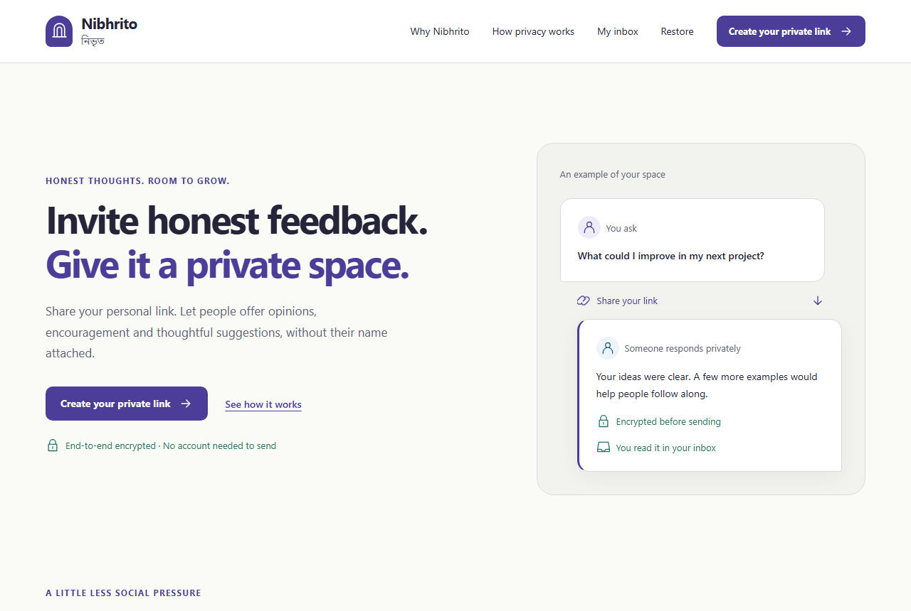
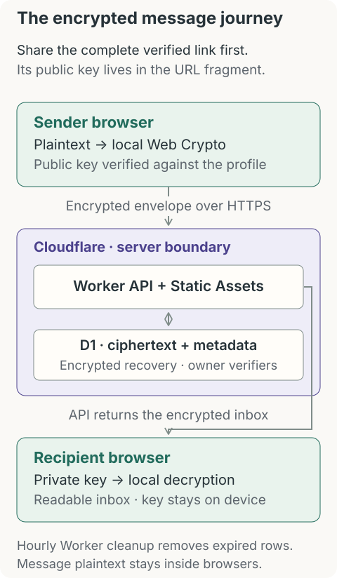

# Nibhrito (নিভৃত)

Privacy-focused anonymous feedback with browser-side end-to-end encryption.

Nibhrito gives people a private place to receive honest opinions, appreciation and
constructive suggestions. Create a profile, save your recovery code and share your
link. Senders need no account. Their messages are encrypted before upload; you read
them by decrypting in your browser.

**Status:** `1.0.0-rc.1`. The MVP and local release checks are complete. Cloudflare
deployment and live release acceptance are pending. See [project status](PROJECT_STATUS.md).

<picture>
  <source media="(prefers-color-scheme: dark)" srcset="docs/assets/overview-dark.png" />
  <source media="(prefers-color-scheme: light)" srcset="docs/assets/overview.png" />
  
</picture>

Both themes are designed deliberately and follow your browser/system preference.
[Light preview](docs/assets/overview.png) · [Dark preview](docs/assets/overview-dark.png).
These show public fictional content, with no private profile or inbox.

## Capabilities

- Text-only feedback, including Bangla, emoji and mixed-language messages.
- Complete share links with a verified public key and locally generated QR codes.
- Encrypted inbox with local search, filters, pagination and message deletion.
- Recipient-controlled retention, incoming-message pause and profile deletion.
- Recovery on another device using a saved code; encrypted local archive downloads.
- Responsive light/dark interface, keyboard navigation and automated accessibility checks.

There are no email/password accounts, attachments, analytics or third-party runtime scripts.

## How it works

1. The recipient's browser generates encryption keys and a separate owner token.
   Setup requires confirmation that the recovery code has been saved.
2. The recipient shares the **complete** `/u/<slug>#v=1&pk=...` link. Its fragment
   carries the public key and is absent from the initial HTTP request.
3. The sender's browser validates the link and encrypts the message with native
   Web Crypto. Only the encrypted envelope is submitted.
4. The authenticated inbox fetches ciphertext and decrypts locally. Expired
   messages stop appearing immediately; bounded cleanup later removes their rows.

<picture>
  <source media="(prefers-color-scheme: dark)" srcset="docs/assets/message-flow-dark.svg" />
  <source media="(prefers-color-scheme: light)" srcset="docs/assets/message-flow-light.svg" />
  
</picture>

The same Worker deployment serves the static application and API. An hourly Cron
Trigger performs bounded expiry cleanup. Storage sits behind repository interfaces
and committed SQL migrations.

## Privacy and encryption

Messages are **anonymous to the recipient**, not guaranteed untraceable. Profile
names, slugs and prompts are public. The backend retains ciphertext, encrypted
recovery bundles, owner-token verifiers, delivery timestamps and short-lived abuse
control counters. HMAC network buckets are pseudonymous; the application does not
persist raw IP addresses, but the network provider processes connection metadata.

The v1 protocol uses ephemeral P-256 ECDH, HKDF-SHA-256 and AES-256-GCM. The working
recipient private key is a non-extractable `CryptoKey` in IndexedDB. Recovery
material is encrypted before storage; the recovery secret never goes to the server.
Owner authentication uses a separate bearer token, sent only to authenticated API
routes. The server stores its SHA-256 verifier.

Important limits:

- You must trust the delivered frontend, browser and device. Malicious future
  JavaScript or a compromised endpoint can read plaintext or use local keys.
- v1 does not provide full forward secrecy after recipient-key compromise,
  sender identity proof or individual-device revocation.
- Losing local access and the recovery code means losing access to your messages.
  Anyone who obtains the code can restore the profile.
- Deletion cannot erase prior copies or temporary provider backups. Encrypted
  archives retain copied messages after server expiry.
- The server cannot moderate encrypted message contents. Quotas, rate limits and
  recipient controls reduce abuse but do not guarantee availability.

Read the [protocol](docs/03_E2EE_PROTOCOL.md), [threat model](docs/04_SECURITY_THREAT_MODEL.md)
and [security self-review](SECURITY_REVIEW.md). These are not independent certifications.

## Stack

React · strict TypeScript · Vite · Tailwind CSS · native Web Crypto · IndexedDB ·
Cloudflare Workers with Static Assets · D1/SQLite · Vitest · Playwright · axe-core.

Runtime packages are React, React DOM and a local QR encoder. There is no
third-party cryptography library. Direct versions and transitive integrity are locked.

## Quick start

Use Git, Node **24.14.1** (pinned in `.node-version`) and npm **9 or newer**.
From the cloned repository root:

```sh
npm ci
npx playwright install chromium firefox webkit
npm run dev
```

Open <http://127.0.0.1:8787>. No Cloudflare account or external credentials are
needed. `dev` generates an ignored local server rate secret, applies both local
migrations, builds the frontend and starts the Worker. Use synthetic feedback.

To inspect or apply local migrations separately:

```sh
npm run db:list:local
npm run db:migrate:local
```

Frontend edits require a rebuild; an optional Vite HMR workflow is described in
[local development](docs/14_LOCAL_DEVELOPMENT.md). Never put secrets in `VITE_*`
variables, committed config, issue reports or screenshots.

## Repository map

| Path                  | Purpose                                                            |
| --------------------- | ------------------------------------------------------------------ |
| `src/`                | Browser UI, crypto, recovery and local storage                     |
| `worker/`             | API routes, authorization, abuse controls and storage repositories |
| `shared/`             | Versioned envelopes, schemas, encoding and API types               |
| `migrations/`         | D1/SQLite schema and counter triggers                              |
| `tests/`              | Unit, local D1 integration and browser/security journeys           |
| `scripts/`            | Local setup, privacy checks and guarded deployment tooling         |
| `docs/`               | Architecture, development, operations and acceptance evidence      |
| `.github/`            | CI, dependency updates and contribution templates                  |
| `.agent/`, `prompts/` | Maintainer planning records and agent instructions                 |

## Testing and verification

```sh
npm run check
npm run test:repository
npm run repository:check
# Additional local gate when Microsoft Edge is installed:
npm run test:edge
```

`check` covers formatting, lint, strict TypeScript, unit/integration tests, a
production build, three-engine browser tests (including accessibility), Worker
dry run, privacy checks and dependency audit. `repository:check` inspects current
files and Git history for common credentials and unwanted generated files; manual
review is still required for content and images.

Browser tests use disposable profiles/databases. Traces, screenshots, video and
private DOM failure snapshots stay disabled. A deliberate failing-assertion probe
verifies artifact privacy before each browser suite. CI runs the same portable
gate without Cloudflare credentials or deployment.

[Final verification](FINAL_VERIFICATION.md) records local evidence;
[release acceptance](docs/20_RELEASE_ACCEPTANCE.md) lists remaining physical-device,
assistive-technology and live operator checks.

## Deployment

The target is one Cloudflare Worker with Static Assets, D1 and scheduled cleanup,
using the free tier first. No service is deployed yet, and CI does not deploy.
Provider terms and capacity can change.

Follow [deployment and operations](docs/16_DEPLOYMENT_OPERATIONS.md) for login,
provisioning, migrations, guarded configuration/secrets, live acceptance and rollback.
The production example contains placeholders and cannot be deployed. Keep API
calls on the same origin. Do not tag `v1.0.0` until live acceptance passes.

## Documentation and contributions

Start with the [documentation index](docs/README.md) and
[implementation overview](IMPLEMENTATION.md).
The [design guide](DESIGN.md) explains the visual system and theme behavior.
Read [CONTRIBUTING.md](CONTRIBUTING.md) before a pull request.
Report vulnerabilities privately as described in [SECURITY.md](SECURITY.md);
use public issues only for non-sensitive bugs and feature suggestions.

## License

No license has been selected. Publication does not grant a software license;
the owner must make an explicit licensing decision.
