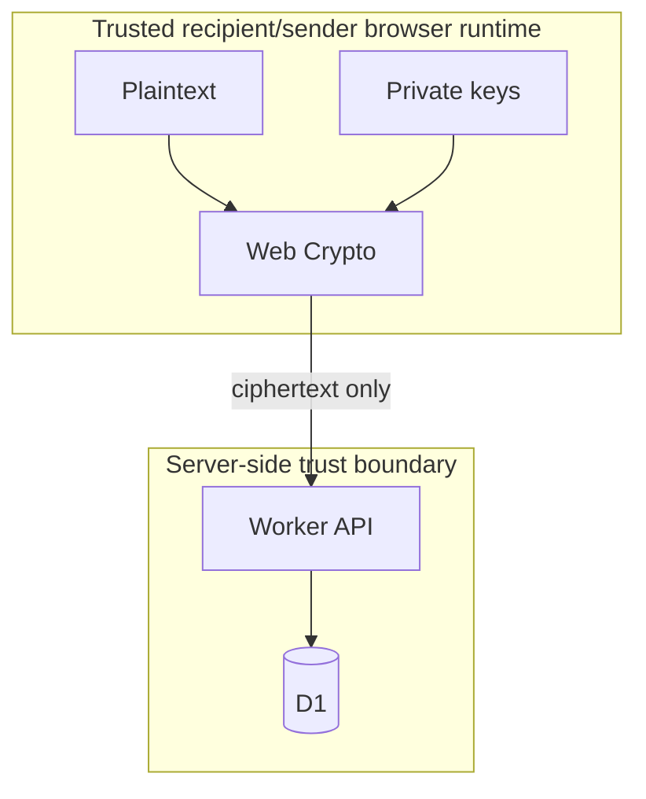

# 02 - System Architecture

## Components

### Browser client

Responsibilities:

- profile key generation,
- message encryption/decryption,
- recovery encryption/decryption,
- IndexedDB key persistence,
- share-link parsing and validation,
- plaintext rendering,
- client-side QR generation,
- client-side decrypted search/filtering.

The browser is the only component permitted to see normal message plaintext.

### Worker API

Responsibilities:

- schema validation,
- public profile metadata,
- encrypted message storage/retrieval,
- owner authorization,
- rate limits and quotas,
- expiry timestamps,
- profile lifecycle,
- scheduled cleanup,
- security headers.

The Worker must treat ciphertext as opaque bytes/text.

### D1

Stores public metadata and opaque encrypted envelopes. It must not contain message plaintext, recovery secrets, or recipient private keys in plaintext.

## Trust boundaries



## Frontend module boundaries

Recommended modules:

```text
src/crypto/protocol.ts
src/crypto/encoding.ts
src/crypto/keyring.ts
src/crypto/recovery.ts
src/crypto/fingerprint.ts
src/storage/indexedDb.ts
src/features/profile/
src/features/send/
src/features/inbox/
src/features/recovery/
src/lib/api.ts
src/lib/security.ts
```

Keep `src/crypto` free of React imports. It should be testable as a pure browser/Web Crypto library.

## Backend module boundaries

```text
worker/index.ts
worker/routes/profiles.ts
worker/routes/messages.ts
worker/routes/recovery.ts
worker/middleware/auth.ts
worker/middleware/rateLimit.ts
worker/middleware/securityHeaders.ts
worker/repositories/profileRepository.ts
worker/repositories/messageRepository.ts
worker/repositories/recoveryRepository.ts
worker/security/redaction.ts
```

## Dependency rules

- `src/crypto` may use Web Crypto and encoding helpers only.
- UI may depend on `src/crypto`; crypto must not depend on UI.
- Worker must never import client private-key functions.
- Shared schema/types must not contain runtime secrets.
- No circular imports across browser/backend boundaries.

## Public key in URL fragment

Canonical share link:

```text
https://<host>/u/<slug>#v=1&pk=<base64url-p256-public-key>
```

The fragment stays client-side during navigation. The sender client must:

1. require `v=1`,
2. decode the public key,
3. import it as ECDH P-256,
4. compute `key_id = SHA-256(raw_public_key)`,
5. use it for message envelope metadata,
6. refuse submission if the fragment is malformed or absent in verified mode.

Do not silently replace a missing `#pk` with a key fetched from the backend.

## Availability vs privacy modes

MVP should have one secure behavior: full verified link required to send.

If a future product decision introduces a slug-only compatibility mode, it must be visibly labelled as unverified and disabled by default. Do not add it during MVP implementation.

## Storage portability

Use plain SQL migrations and repository interfaces. Avoid placing D1 APIs directly throughout route handlers. This allows later replacement with Postgres, libSQL, or another SQL backend.
